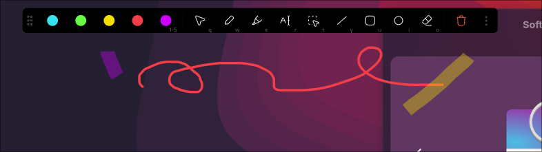

# splein


[](https://crates.io/crates/splein)


[](https://github.com/emilien-jegou/splein)
[](https://deps.rs/crate/splein/latest)

**splein** is a screen annotation overlay for Wayland compositors (Hyprland, Sway), built in Rust.

> [!WARNING]
> **Demo Preview / Work in Progress**: This project is in active development. Several UI elements and tools (such as the Text and Select Region tools) are placeholders and not yet fully implemented.



---

## Features

* ✍️ **$O(1)$ Pencil Tracing**: Silky, organic curves with zero cursor lag or wobble.
* ⚡ **Starts in ms**: Instant toggle via `wlr-layer-shell`.
* ⌨️ **Collocated keybinds**: 'qwerty..' for tools, '12345' for colors.
* 🎯 **Central Daemon**: Turn overlay on/off without losing your context or window running.

---

## ⌨️ Hotkeys (In-Canvas)

| Key | Tool / Action | Description |
| :--- | :--- | :--- |
| **`q`** | **Pointer / Move** | Move any drawn element across the screen |
| **`w`** | **Pen** | Freehand vector pen with live cursor tracking |
| **`e`** | **Highlighter** | Translucent marker with smooth rounded corners |
| **`r`** | **Text** | Text annotation placement |
| **`t`** | **Select Region** | Area selection box |
| **`y`** | **Line** | Straight line with live drag preview |
| **`u`** | **Rectangle** | Rounded box with live drag preview |
| **`i`** | **Ellipse** | Dynamic horizontal/vertical ellipse preview |
| **`o`** | **Eraser** | Delete elements on touch |
| **`1` – `5`** | **Colors** | Cyan, Green, Yellow, Red, Purple |
| **`z`** | **Undo** | Reverts the last completed element |
| **`Backspace` / `Del`** | **Clear** | Clears the entire canvas |
| **`Esc`** | **Close** | Exits overlay back to desktop interaction |

---

## 🚀 Usage with Hyprland

Add to your `hyprland.conf`:

```ini
# Start the overlay daemon on login
exec-once = splein daemon

# Keybindings
bind = SUPER, d, exec, splein toggle
bind = SUPER SHIFT, d, exec, splein clear
bind = SUPER CTRL, z, exec, splein undo
```

---

## 📦 Installation

### Cargo

```sh
cargo install splein
```

### Nix Flakes

Add to your `flake.nix`:

```nix
inputs.splein.url = "github:emilien-jegou/splein";
```

Include in your configuration:

```nix
environment.systemPackages = [ inputs.splein.packages.${pkgs.system}.default ];
```

---

## 🙏 Credits

* [Ratatui](https://github.com/ratatui/ratatui) & [Crossterm](https://github.com/crossterm-rs/crossterm)
* [Smithay Client Toolkit](https://github.com/Smithay/client-toolkit)
* [tiny-skia](https://github.com/RazrFalcon/tiny-skia)
